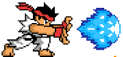

# Street Fighter II : The World Warrior

Desarrollado por **[Capcom](https://www.capcom.com/)** y lanzado originalmente para arcade en 1991, es la segunda entrega de la saga pero la primera en alcanzar la fama mundial y sentar marcar precendentes en el génera lucha de los videojuegos.

Este repositorio consta de un sitio web para el videojuego Street Fighter II : The World Warrior.
Su objetivo es brindar información acerca sus diferentes versiones(los ports se omiten), personajes y que permita jugar un demo del mismo. Tendrá un **Diseño Responsive** para los usuarios de dispositivos más pequeños.

# Tecnologías
    HTML5
    CSS3
    JavaScript
    Emulador de GameBoy Advance Online
    PhotoShop

# Estado: En desarrollo

Ver Ahora

Autor: [Grace Silva](https://github.com/Grace-Silva)